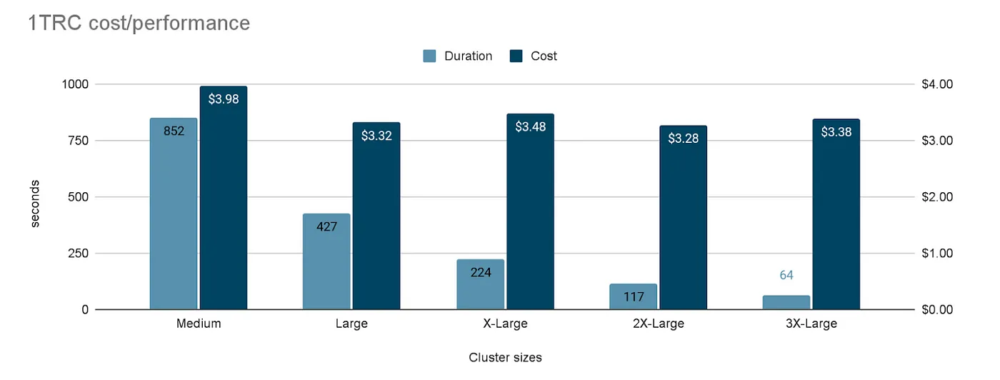

# 1 Trillion Row Challenge on Databricks SQL

## Introduction
In February 2024 [Coiled](https://www.coiled.io/) team published their [One Trillion Row Challenge](https://medium.com/coiled-hq/one-trillion-row-challenge-5bfd4c3b8aef) where they presented their performance test over 1T (One Trillion) rows dataset. The idea of the performance test is to measure performance when reading and aggregating one trillion records based on synthetic temperature measurements dataset.

As we were amazed by the idea and the simplicity of the test and wanted to test the capabilities of Databricks SQL, we have accepted the challenge.

## Data Generation
We could obviously download the dataset shared by the Coiled team which is available in their S3 bucket s3://coiled-datasets-rp/1trc. However, we decided to generate our own data using SQL to make the experiment very simple and easy to reproduce. Below you can find the code we used to generate the test table containing 1 trillion (1,000,000,000,000) records.

First, we created the **stations** lookup table using a values() clause with the original data for 412 stations in the CSV.

```sql
create or replace table `1trc`.`stations`
using delta
as
select id, station, mean_temp
from values (1,'Abha',18.0), 
(2,'Abidjan',26.0), 
(3,'Abéché',29.4),
…
(413,'Zürich',9.3)
AS data(id,station,mean_temp);
```

Next, we generated the measurements table with a normal distribution of sample values using the approach described by [Phil Factor](https://www.red-gate.com/simple-talk/author/phil-factor/) in [Getting normally-distributed random numbers in TSQL](https://www.red-gate.com/simple-talk/blogs/getting-normally-distributed-random-numbers-in-tsql/) blog post.

```sql
create or replace table `1trc`.`measurements_delta`
as
select a.station,
     round(((rand() * 2 - 1) + (rand() * 2 - 1) + (rand() * 2 - 1)) /* Box-Muller transform */
      * 5 /* Standard Deviation */
      + a.mean_temp, 1) as measure
from `1trc`.`stations` as a
join (range(1000000000000)) b on a.id = (mod(b.id, 412)+1);
```

With this code we are able to generate the test dataset in a simple and concise way and also leverage Databricks capabilities to parallelize the computations over multiple cluster nodes.

For reference, we tested the data generation using a **2X-Large** Databricks SQL Serverless warehouse, it completed in **~12 minutes**.

Our final **measurements** table with 1 trillion rows is composed of 256 files and is 1.2 TiB in size. The exact number of files generated may change depending on the warehouse size used but the total data size and query performance will not change significantly.

```sql
describe history `1trc`.`measurements_delta`;
-- `Operation Metrics` column:
–   { "numFiles": "256", 
--  "numOutputRows": "1000000000000",
--  "numOutputBytes": "1341928982163" }
```

### Test Execution
Finally, we executed a sample test query on [Databricks SQL Warehouse](https://www.databricks.com/product/databricks-sql). We used the following configuration for testing:
- Databricks on AWS
- Databricks SQL Serverless
- Current channel, v 2023.50

We used different cluster sizes to evaluate the performance depending on the compute capacity.

To avoid the impact of [Query Result Cache](https://docs.databricks.com/en/sql/user/queries/query-caching.html) we added the following SET statement to the test query.
```sql
SET use_cached_result=false;
```

Databricks also has a [local Disk Cache](https://docs.databricks.com/en/optimizations/disk-cache.html) to speed up subsequent queries on the same table. To avoid this speedup in our measurements we restarted each Databricks SQL Warehouse before every test query execution.

```sql
SELECT station, min(measure), max(measure), mean(measure)
FROM `1trc`.`measurements_delta`
GROUP BY station
ORDER BY station;
```

The test query aggregates all records from the table, hence it is I/O intensive.

## Test Results
During our test runs we have achieved the following results.

| Cluster Size | Table Type | Duration, s | DBUS/hours | Price per DBU | Cost, $ |
|--------------|:----------:|------------:|-----------:|--------------:|--------:|
| Midium       | Delta      | 852         | 24         |  $0.70        | $3.98   |
| Large        | Delta      | 427         | 40         |  $0.70        | $3.32   |
| X-Large      | Delta      | 224         | 80         |  $0.70        | $3.48   |
| 2X-Large     | Delta      | 117         | 144        |  $0.70        | $3.28   |
| 3X-Large     | Delta      | 64          | 272        |  $0.70        | $3.38   |


We have the same results also represented as charts combining both query duration and cost per query (both lower is better).


## Conclusion
In conclusion, the performance and scalability of Databricks SQL Serverless have been demonstrated. The ability to query massive tables with ease and near-linear performance improvements as the cluster size increases prove the platform’s capabilities.

We are also very proud to see that the cost for each experiment is almost identical regardless of the cluster size used. This linear cost scaling is very difficult to achieve and means you can rely on getting the maximum possible performance per $ as your data becomes increasingly large.

Even more impressive is the fact that data analysts can access this compute power almost instantly, without the need for excessive management or provisioning overhead. The inherent flexibility and on-demand nature of Databricks SQL Serverless make it a compelling choice for organizations seeking to maximize the value of their data. And, if you plan to run a query like this as part of your scheduled ETL processing, you can use Databricks Workflows with customized compute options to deliver optimal ETL cost.